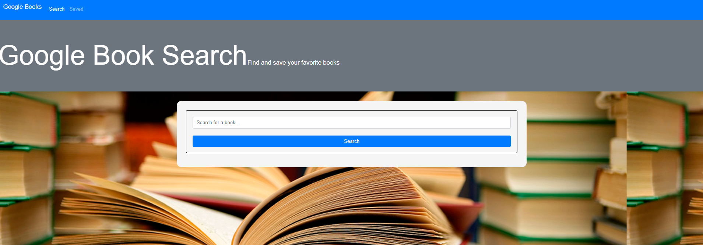
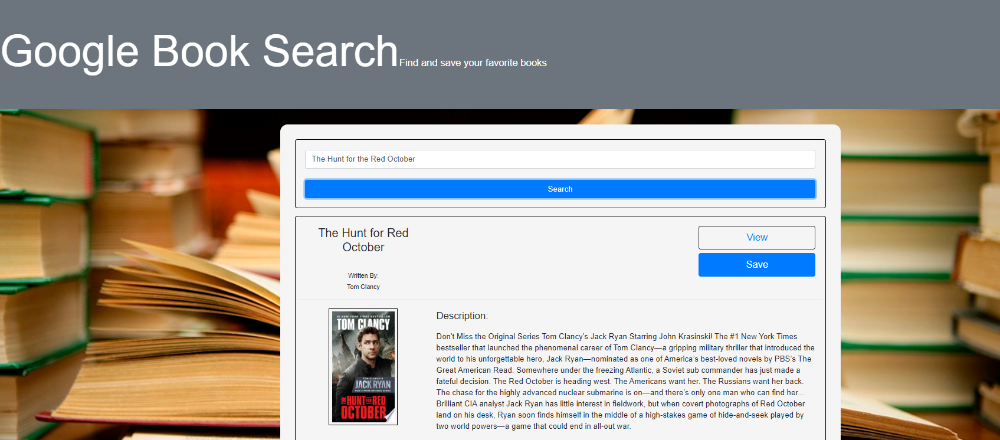

# GoogleSearch

# Table of Contents
* [Description](#description)
* [User_Story](#user_story)
* [Links](#links)
* [Email_Address](#email_address)
* [Project_Images](#project_images)

# Description
  This is a React-based Google Books Search app to find your favorite book

# User_Story
  Looking for information on your favorite book? Use the Google Books Search to find all the details
  with a simple click. 

# Links

Heroku - https://immense-caverns-56822.herokuapp.com/

Github - https://github.com/JoeWills615/GoogleSearch
  
# Email_Address
  JoeWills615@gmail.com

# Project_Image

  
   
   
  
   
   
   
   
  
